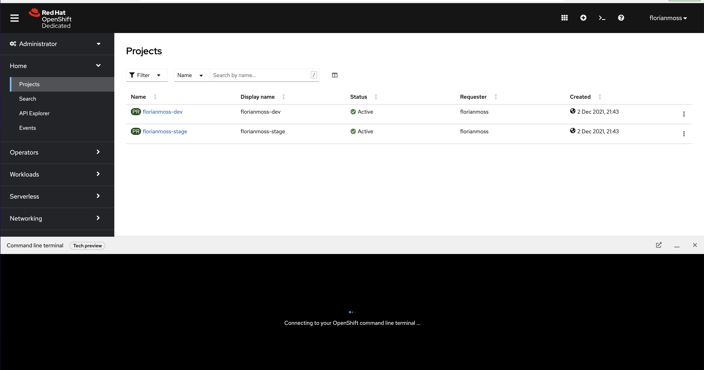
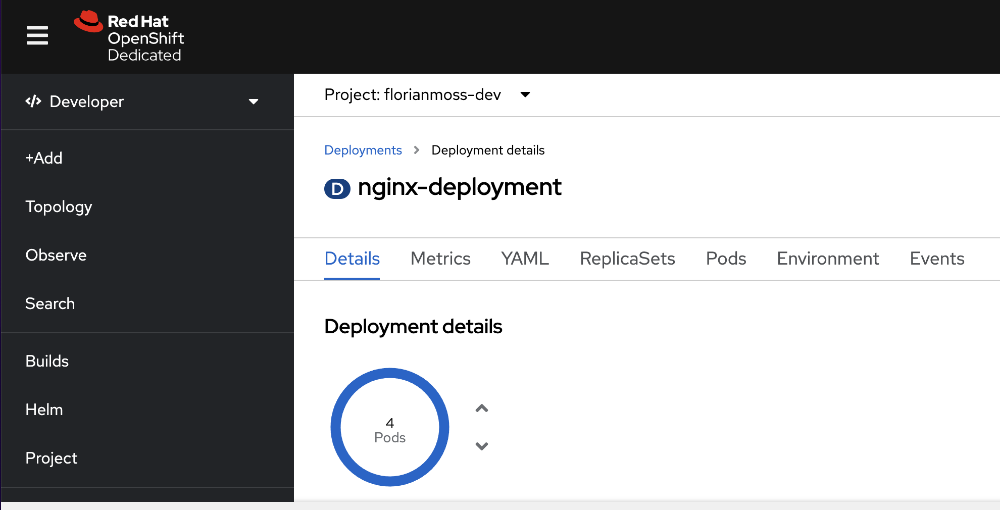
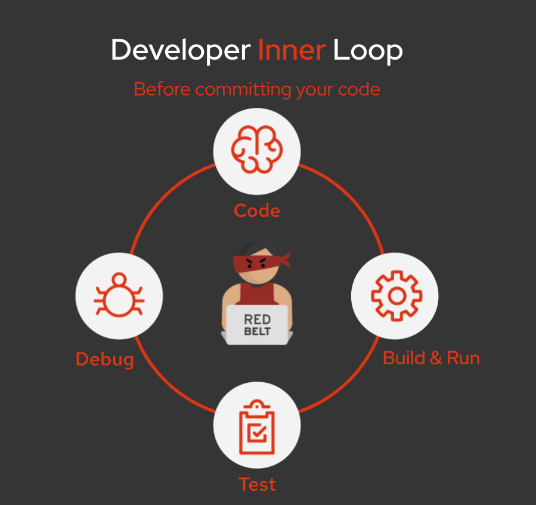

# Openshift Developer Enablement
👋 &nbsp;👋 &nbsp;👋 &nbsp;👋 &nbsp;👋 &nbsp;👋 &nbsp;👋 &nbsp;👋

This is repo contains content for the developer onboarding workshop. Over the coming weeks, we will have multiple sessions together that will include **Workshops**, **self-guided training** and **online classrooms**. 

👀 &nbsp; 🚨

The main hub for us is the **Miro board**, a link to the board was distributed this morning and will be shared via E-Mail. Please <a href="mailto:fmoss@redhat.com">E-Mail me</a> if you can't find the link or don't have access to the Miro board.

## Week 1 - Workshop - Introduction to OpenShift

We will start with a light introduction, going through the objectives over the next few weeks and introducing OpenShift. 

📫 &nbsp; **Content and Links**

- [Presentation](https://github.com/florianmoss/openshift-developer-enablement/blob/master/week1/OpenShift4%20%20-%20Developers%20Edition.pdf)

📋 &nbsp; **Tasks**

- Confirm your _Miro board access_
- Get yourself a _[developer sandobox](https://developers.redhat.com/developer-sandbox/get-started)_

🥅  &nbsp; **Goals**

- Being able to describe what OpenShift is
- Not being afraid of what's ahead

## Week 2 - Online Classroom - Introduction to Docker/Podman/Containers

The 🥅 &nbsp; for this week is to understand what a container is, how it differs from traditional application, and how a container works.

You can find a 💡 **full script** for this session [here.](https://github.com/florianmoss/openshift-developer-enablement/blob/master/week2/containers.md) The script gives a little bit more **background** to the presentation, includes a small **quiz**, and expands on the slides.

If you are interested in the  📑 &nbsp; **PDF** to the **presentation**, please find this [here.](https://github.com/florianmoss/openshift-developer-enablement/blob/master/week2/presentation/ContainersContainersContainers.pdf)

All hands-on exercises are available via the [online lab section.](https://lab.redhat.com/) More on this below.


## Week 2 - Self Guided Exercises

1. **[mandatory]** &nbsp; 💪 &nbsp; 👶

    Read through the linked material for week 2 and make sure you understand the differences between: image, container, image registry and container runtime. 

2. **[mandatory]** &nbsp; 💪 &nbsp; 👶 

    Do the following hands-on labs:

    - [Creating images with Container Tools [buildah]](https://lab.redhat.com/buildah)
    - [Deploying containers using Container Tools [podman]](https://lab.redhat.com/podman-deploy)
    - [Build an application into a container image using RHEL Container Tools](https://lab.redhat.com/containerize-app)

3. **[mandatory, except the last step]** &nbsp; 💪 &nbsp; 🥷

    - Open a RHEL sandbox environment in the [lab section](https://lab.redhat.com/sandbox).
    - Run ❗ ```yum update -y``` ❗, this will update your system to the latest versions, unfortunately this takes 5-7 min, keep reading whole your system updates
    - Make sure that ```buildah``` and ```podman``` are installed in your environment. You can use ```yum install <name>``` for this
    - Check how many ```buildah images``` you have present on your host
    - Use this [Dockerfile](https://github.com/florianmoss/openshift-developer-enablement/blob/master/week2/nodeJS-sample/Dockerfile) and this [amazing node.JS application](https://github.com/florianmoss/openshift-developer-enablement/blob/master/week2/nodeJS-sample/app.js) to build a new image. You can create the 3 relevant files with ```vi Dockerfile```, ```vi app.js``` and ```vi package.json``` and copy the content over
    
        **Hint:** ```buildah bud -f Dockerfile -t <image-name> .```

    - Revise the Dockerfile and understand what is happening, the [following resource](https://catalog.redhat.com/software/containers/ubi8/nodejs-12/5d3fff015a13461f5fb8635a) will help you

    - Use ```podman``` to list your local images. Use the image you have created with buildah to ```create``` and ```start``` a container. Use the [podman docs](https://docs.podman.io/en/latest/Commands.html) if needed
    
    - On which port did your container start? 

    - 🔑 &nbsp; Rather than using the Dockerfile, can you build an image using `buildah` CLI commands?

## Week 3 - Online Classroom - Core Kubernetes Concepts

The 🥅 &nbsp; for this week is to understand what Kubernetes is, how Kubernetes works and what you absolutely must understand as a developer. This week is a step up from last week and will require additional reading. 💥 &nbsp; Please spend some time outside of the theory and practical session on revising the theory.

You can find a 💡 **full script** for this session [here.](https://github.com/florianmoss/openshift-developer-enablement/blob/master/week3/kubernetes.md) The script gives more **background** to the presentation and expands on the slides - it also includes references to additional reading.

If you are interested in the &nbsp; 📑 &nbsp; **PDF** to the **presentation**, please find this [here.](https://github.com/florianmoss/openshift-developer-enablement/blob/master/week3/presentation/kubernetes.pdf)

## Week 3 - Self Guided Exercises
This week is tough &nbsp; 💪 &nbsp;, no doubt. You will have to go through the theory more than once and do a good amount of reading.

But let's finally get to the fun &nbsp; 🤠 &nbsp; part!

You should have requested your [OpenShift Developer Sandbox](https://developers.redhat.com/developer-sandbox/get-started) over the past 2 weeks, please access it now.


In the top right, please select the ```Terminal``` icon (left from the "?"). You will see that a terminal opens at the bottom of your screen.

Expand the terminal by dragging it up.




1. **Some basis kubectl commands**
    - Run ```kubectl --help``` and have a look at the options available to you. 
    - Check which namespace you are currently using: ```kubectl config view --minify | grep namespace:```
    - Deploy your first container in a pod: ```kubectl run nginx --image=nginx```
    - Confirm that the pod deployed successfully: ```kubectl get pods```
    - What do you see in the status? Minimise the terminal first. Select ```Project``` -> ```username-dev``` -> ```Pods``` (scroll down)

    
    
    

    Select the ```nginx``` pod and click on ```Events```.

    Damn, it looks like we tried pulling an image from docker.com but they don't like that anymore!

2. **Deploying a Pod**
    - We can easily avoid this issue by deploying an image that we are pulling from a different registry, like quay.io: ```kubectl run hello-world --image=quay.io/redhattraining/hello-world-nginx```
    - Now, list all Pods in your current namespace
    - We have never actually written a YAML file for this, that's why we want to review what we just created: ```kubectl run hello-world --image=quay.io/redhattraining/hello-world-nginx```
    - Are there any resource restriction applied to our pod? Such as memory or CPU constraints?
    - Delete the pod ```hello-world``` that we created earlier

3. **Createing a Deployment**
    - Use the following YAML specification to deploy your first ```Deployment```, make use of the ```kubectl apply -f <file>.yaml``` command:

```yaml
apiVersion: apps/v1
kind: Deployment
metadata:
  name: nginx-deployment
  labels:
    app: nginx
spec:
  strategy:
    type: RollingUpdate
    rollingUpdate:
      maxUnavailable: 50%
  replicas: 4
  selector:
    matchLabels:
      app: nginx
  template:
    metadata:
      labels:
        app: nginx
    spec:
      containers:
      - name: nginx
        image: quay.io/redhattraining/hello-world-nginx:latest
        ports:
        - containerPort: 80
```

- Minimize your terminal and have a look around, visually inspect the new Deployment in the GUI




- Manually delete one of the pods as seen in the image below. What do you think is gonna happen?


- Can you explain why we have still 4 pods running? 

- Change the deployment config to 5 replicas (you can use the terminal or OpenShift GUI). Verify that 5 containers are running.

4. **Creating a Database and Backend Service**
- For the final exercise we will bring a few things together, Deployments, Environment Variables and ConfigMaps.

Our target deployment looks like this:


It consists of a PostgreSQL database and nodeJS service that list the car details.

- **Deploy a Database**

- `oc new-app postgresql-persistent --name dbapp --param DATABASE_SERVICE_NAME=aadb --param POSTGRESQL_USER=developer --param POSTGRESQL_PASSWORD=developer --param POSTGRESQL_DATABASE=aadb`

- Check out the Environment variables:
        
        POSTGRESQL_USER

        POSTGRESQL_PASSWORD

        POSTGRESQL_DATABASE

- Run `oc get pods` and confirm that the DB is running

- Open the OpenShift UI, select the DeploymentConfig ```aadb``` in the Topology, open the Pods section, select the only pod availabe and go to terminal, you are now connected to the inside of the running pod. We can use this to insert data into our database: 

```bash
psql -U developer -d aadb 

CREATE TABLE cars (
	car_id serial PRIMARY KEY,
	brand VARCHAR ( 50 ) NOT NULL,
	make VARCHAR ( 50 ) NOT NULL,
	price VARCHAR ( 50 ) NOT NULL,
	image VARCHAR ( 500 ) NOT NULL
);

INSERT INTO cars (brand, make, price, image) VALUES ('Audi', 'A5', '55.000', 'https://motoringmatters.ie/wp-content/uploads/2019/09/audi-a5_03.jpg');

INSERT INTO cars (brand, make, price, image) VALUES ('BMW', '4 Series', '58.000', 'https://cdn1.buyacar.co.uk/sites/buyacar/files/bmw-4-series-1.jpg');

INSERT INTO cars (brand, make, price, image) VALUES ('Mercedes', 'C Class', '65.000', 'https://carwow-uk-wp-0.imgix.net/mercedes-c-class-revealed-front-1.jpg?auto=format&cs=tinysrgb&fit=clip&ixlib=rb-1.1.0&q=60&w=750');

INSERT INTO cars (brand, make, price, image) VALUES ('Porsche', '911', '150.000', 'https://cdn.motor1.com/images/mgl/nr6Jx/s1/porsche-911-carrera-992-2019.jpg');

SELECT * FROM cars;
```

- **Deploy the Backend**

- Open the Topolgy.

- Right click -> Add Project -> From Git -> Insert Git Url from below ->  Proceed with defaults and deploy.

- Git repository: `https://github.com/florianmoss/cars-backend`

- Inspect the index.js and queries.js file.

- No Dockerfile needed.

- Select Topology and ```car-backend``` deployment and add the environment variables as seen below. The ``dbport`` and ``dbhost`` are environment variables specified by us, the ```dbpassword```, ```dbdatabase``` and ```dbuser``` are environment values that come from the DB and don't have to be visible to us deploying the backend.


- Btw: The [queries.js](https://github.com/florianmoss/cars-backend/blob/master/queries.js) file specifies which environment variables are needed

- In the Topology, on the top right of the nodeJS icon, select the URL icon as seen below


- Add the `/cars` route to the end, this will query our cars database and display the cars we have entered.

- Congratulations, you have just deployed a database and a microservice!

- **Important note spotted by Alan: You need to remove the HTTPS from the route in the URL bar. We don't have a certificate deployed, Chrome and Firefox automatically secure traffic though. Simply make http:// instead of https:// in the URL bar and it will work fine.**


## Week 4 - Online Classroom - Kubernetes/OpenShift for Developers

After going into quite a bot of detail last week &nbsp;🤯 &nbsp;, explaining Kubernetes concepts and interacting with the `kubectl` CLI as well as the `oc` CLI, we are gonna bring it back up this week &nbsp;😇 &nbsp;. The content for this week is easy to consume and really focused on the practical aspects of your `Inner-Loop Development`.


For simplicity reasons, the outer-loop conversation was excluded from the content.

------
✅ &nbsp; Please find this weeks [presentation here](https://github.com/florianmoss/openshift-developer-enablement/blob/master/week4/OpenShift4%20%20-%20Developers%20Edition.pdf)

🎁 &nbsp; You will also appreciate that there is no script this week. There was enough reading to do over the past 2-3 weeks. This week is all about `o-do`.

------

## Week 4 - Self Guided Exercises

This weeks [exercise can be found here.](https://florianmoss.github.io/inner-loop-guide/inner-loop/5.1/index.html)

The hands-on part includes:
- *[CodeReady Workspaces](https://developers.redhat.com/products/codeready-workspaces/overview)* (developing code directly on top of OpenShift &nbsp; 🤯 &nbsp; /remote dev environment)
- *[odo](https://docs.openshift.com/container-platform/4.9/cli_reference/developer_cli_odo/understanding-odo.html)* (Git like approach to interacting with deployments)
- *[S2I - Source to Image](https://github.com/openshift/source-to-image)* (A tool for building artifacts from source and injecting into container images)