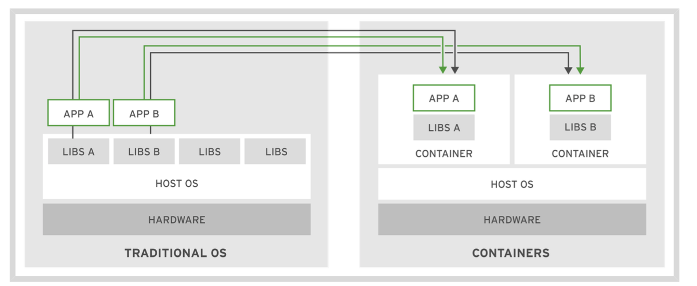
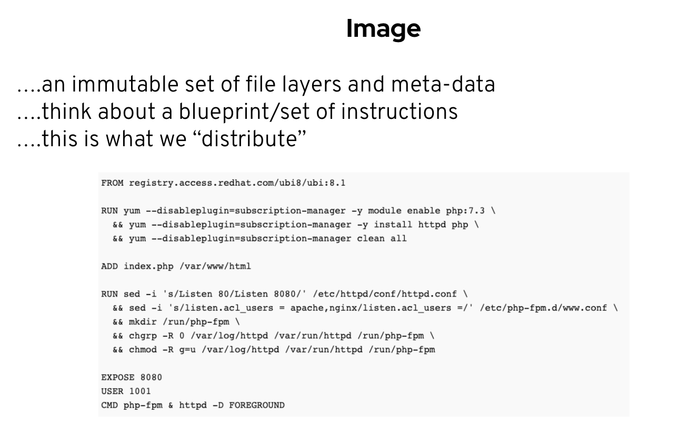
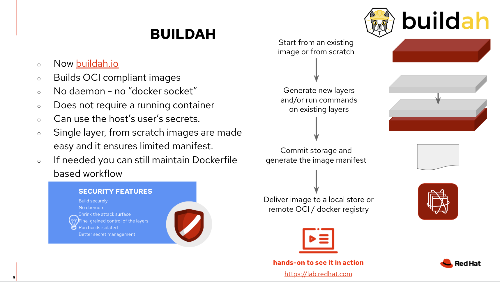
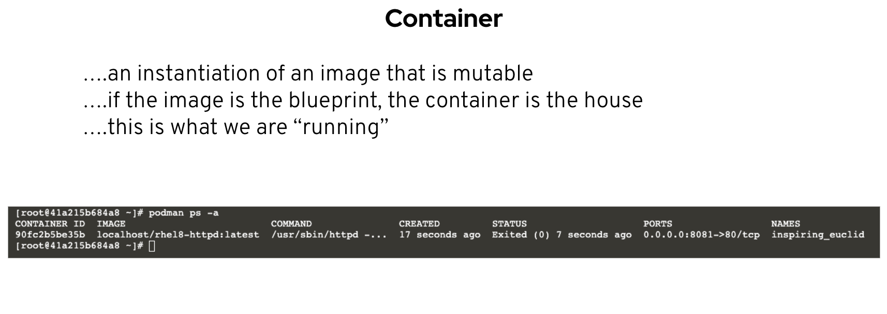
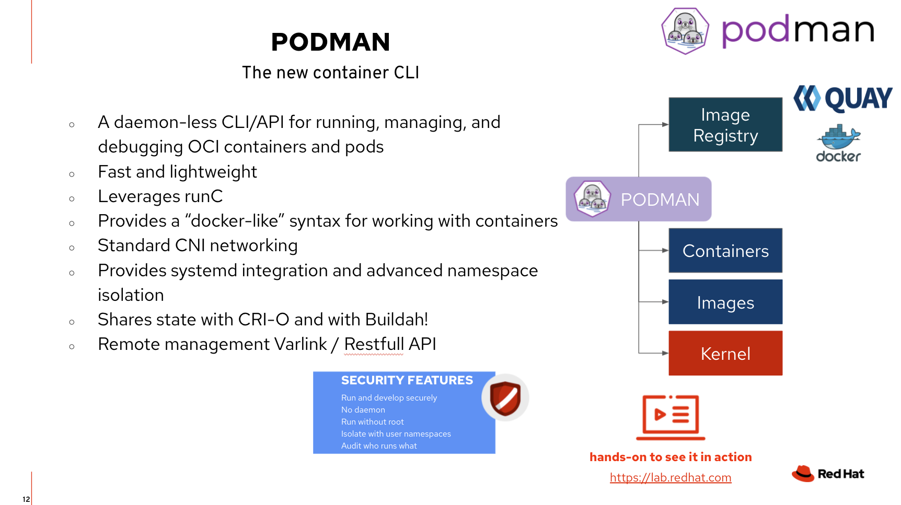

**Table of Contents**
1. [Containerized Applications](#containerized-applications)
1. [Quiz: Overview of Container Technology](#quiz-overview-of-container-technology)
1. [Overview of Container Architecture](#overview-of-container-architecture)
    - [Describing Linux Container Architecture](#describing-linux-container-architecture)
    - [Containerized Applications](#managing-containers-with-podman)
    - [Quiz: Overview of Container Architecture](#quiz-overview-of-container-architecture)
1. [Images: Buildah](#image-buildah)
    - [Buildah and Podman relationship](#buildah-and-podman-relationship)
    - [Example: Buildah](#example-buildah)
    - [Example: Dockerfile](#example-dockerfile)
    - [Commands](#buildah-commands)
1. [Containers: Podman](#container-podman)
    - [Overview and Scope](#overview-and-scope)
    - [Rootless](#rootless)
    - [Commands](#commands)
1. [Additional Resources](#additional-resources)
    - [Podman Cheatsheet](https://github.com/florianmoss/openshift-developer-enablement/blob/master/week2/additional-resources/podman_basics.pdf)
1. [Solutions](#solutions)


## Containerized Applications
Software applications typically depend on other libraries, configuration files, or services that
are provided by the runtime environment. The traditional runtime environment for a software
application is a physical host or virtual machine, and application dependencies are installed as part
of the host.

For example, consider a Python application that requires access to a common shared library that
implements the TLS protocol. Traditionally, a system administrator installs the required package
that provides the shared library before installing the Python application.

The major drawback to traditionally deployed software application is that the application's dependencies are entangled with the runtime environment. An application may break when any updates or patches are applied to the base operating system (OS).

For example, an OS update to the TLS shared library removes TLS 1.0 as a supported protocol.
This breaks the deployed Python application because it is written to use the TLS 1.0 protocol for
network requests. This forces the system administrator to roll back the OS update to keep the
application running, preventing other applications from using the benefits of the updated package.
Therefore, a company developing traditional software applications may require a full set of tests to
guarantee that an OS update does not affect applications running on the host.

Furthermore, a traditionally deployed application must be stopped before updating the associated
dependencies. To minimize application downtime, organizations design and implement complex
systems to provide high availability of their applications. Maintaining multiple applications on a
single host often becomes cumbersome, and any deployment or update has the potential to break
one of the organization's applications.

The figure below describes the differences between applications running as a container and running on the host operating system.



Alternatively, a software application can be deployed using a container. A container is a set of one or more processes that are isolated from the rest of the system. Containers provide many of the same benefits as virtual machines, such as security, storage, and network isolation. Containers require far fewer hardware resources and are quick to start and terminate. They also isolate the libraries and the runtime resources (such as CPU and storage) for an application to minimize the impact of any OS update to the host OS, as described in the figure above.

The use of containers not only helps with the efficiency, elasticity, and reusability of the hosted applications, but also with application portability. The Open Container Initiative provides a
set of industry standards that define a container runtime specification and a container image specification. The image specification defines the format for the bundle of files and metadata that form a container image. When you build an application as a container image, which complies with the OCI standard, you can use any OCI-compliant container engine to execute the application.

There are many container engines available to manage and execute individual containers, including Rocket, Drawbridge, LXC, Docker, and Podman. Podman is available in Red Hat Enterprise Linux 7.6 and later, and is used in this course to start, manage, and terminate individual containers.

The following are other major advantages to using containers:

**Low hardware footprint**

Containers use OS internal features to create an isolated environment where resources are managed using OS facilities such as namespaces and cgroups. This approach minimizes the amount of CPU and memory overhead compared to a virtual machine hypervisor. Running an application in a VM is a way to create isolation from the running environment, but it requires a heavy layer of services to support the same low hardware footprint isolation provided by containers.

**Environment isolation**

Containers work in a closed environment where changes made to the host OS or other applications do not affect the container. Because the libraries needed by a container are self- contained, the application can run without disruption. For example, each application can exist in its own container with its own set of libraries. An update made to one container does not affect other containers.

**Quick deployment**

Containers deploy quickly because there is no need to install the entire underlying operating system. Normally, to support the isolation, a new OS installation is required on a physical host or VM, and any simple update might require a full OS restart. A container restart does not require stopping any services on the host OS.

**Multiple environment deployment**

In a traditional deployment scenario using a single host, any environment differences could break the application. Using containers, however, all application dependencies and environment settings are encapsulated in the container image.

**Reusability**

The same container can be reused without the need to set up a full OS. For example, the same database container that provides a production database service can be used by
each developer to create a development database during application development. Using containers, there is no longer a need to maintain separate production and development database servers. A single container image is used to create instances of the database service

*********

Often, a software application with all of its dependent services (databases, messaging, file systems) are made to run in a single container. This can lead to the same problems associated with traditional software deployments to virtual machines or physical hosts. In these instances, a multicontainer deployment may be more suitable.

Furthermore, containers are an ideal approach when using microservices for application development. Each service is encapsulated in a lightweight and reliable container environment that can be deployed to a production or development environment. The collection of containerized services required by an application can be hosted on a single machine, removing the need to manage a machine for each service.

In contrast, many applications are not well suited for a containerized environment. For example, applications accessing low-level hardware information, such as memory, file systems, and devices may be unreliable due to container limitations.

[Link to Open Container Initiative](https://opencontainers.org/)

*********
*********

## Quiz: Overview of Container Technology

1. Which two options are examples of software applications that might run in a container? (Choose two.)
    
    - A database-driven Python application accessing services such as a MySQL database, a file transfer protocol (FTP) server, and a web server on a single physical host.
    - A Java Enterprise Edition application, with an Oracle database, and a message broker running on a single VM.
    - An I/O monitoring tool responsible for analyzing the traffic and block data transfer.
    - A memory dump application tool capable of taking snapshots from all the memory CPU caches for debugging purposes.

*********

2. **Which two of the following usecases are best suited for containers? (Choose two.)**

    - A software provider needs to distribute software that can be reused by other companies in a fast and error-free way.
    - A company is deploying applications on a physical host and would like to improve its performance by using containers.
    - Developers at a company need a disposable environment that mimics the production environment so that they can quickly test the code they develop.
    - A financial company is implementing a CPU-intensive risk analysis tool on their own containers to minimize the number of processors needed.

3. **A company is migrating their PHP and Python applications running on the same host to a new architecture. Due to internal policies, both are using a set of custom made shared libraries from the OS, but the latest update applied to them as a result of a Python development team request broke the PHP application. Which two architectures would provide the best support for both applications? (Choose two.)**

    - Deploy each application to different VMs and apply the custom made shared libraries individually to each VM host.
    - Deploy each application to different containers and apply the custom made shared libraries individually to each container.
    - Deploy each application to different VMs and apply the custom made shared libraries to all VM hosts.
    - Deploy each application to different containers and apply the custom made shared libraries to all containers.

4. **Which three kinds of applications can be packaged as containers for immediate consumption? (Choose three.)**

    - A virtual machine hypervisor
    - A blog software, such as WordPress
    - A database
    - A local file system recovery tool 
    - A web server

*********
PLEASE FIND THE SOLUTIONS AT THE BOTTOM OF THE PAGE
*********

## Overview of Container Architecture
This section is gonna cover the architecture of Linux container and the podman utility to manage containers.

#### Introducing Container History

Containers have quickly gained popularity in recent years. However, the technology behind containers has been around for a relatively long time. In 2001, Linux introduced a project named VServer. VServer was the first attempt at running complete sets of processes inside a single server with a high degree of isolation.

From VServer, the idea of isolated processes further evolved and became formalized around the following features of the Linux kernel:

**Namespaces**

The kernel can isolate specific system resources, usually visible to all processes, by placing the resources within a namespace. Inside a namespace, only processes that are members of that namespace can see those resources. Namespaces can include resources like network interfaces, the process ID list, mount points, IPC resources, and the system's host name information.

**Control groups (cgroups)**

Control groups partition sets of processes and their children into groups to manage and limit the resources they consume. Control groups place restrictions on the amount of system resources processes might use. Those restrictions keep one process from using too many resources on the host.

**Seccomp**

Developed in 2005 and introduced to containers circa 2014, Seccomp limits how processes could use system calls. Seccomp defines a security profile for processes, whitelisting the system calls, parameters and file descriptors they are allowed to use.

**SELinux**

SELinux (Security-Enhanced Linux) is a mandatory access control system for processes. Linux kernel uses SELinux to protect processes from each other and to protect the host system from its running processes. Processes run as a confined SELinux type that has limited access to host system resources.

All of these innovations and features focus around a basic concept: enabling processes to run isolated while still accessing system resources. This concept is the foundation of container technology and the basis for all container implementations. Nowadays, containers are processes in Linux kernel making use of those security features to create an isolated environment. This environment forbids isolated processes from misusing system or other container resources.

A common use case of containers is having several replicas of the same service (for example, a database server) in the same host. Each replica has isolated resources (file system, ports, memory), so there is no need for the service to handle resource sharing. Isolation guarantees that a malfunctioning or harmful service does not impact other services or containers in the same host, nor in the underlying system.

## Describing Linux Container Architecture
From the Linux kernel perspective, a container is a process with restrictions. However, instead
of running a single binary file, a container runs an image. An image is a file-system bundle that contains all dependencies required to execute a process: files in the file system, installed packages, available resources, running processes, and kernel modules.

Like executable files are the foundation for running processes, images are the foundation for running containers. Running containers use an immutable view of the image, allowing multiple containers to reuse the same image simultaneously. As images are files, they can be managed by versioning systems, improving automation on container and image provisioning.

Container images need to be locally available for the container runtime to execute them, but the images are usually stored and maintained in an image repository. An image repository is just a service - public or private - where images can be stored, searched and retrieved. Other features provided by image repositories are remote access, image metadata, authorization or image version control.

There are many different image repositories available, each one offering different features:

• Red Hat Container Catalog [https://registry.redhat.io]

• Docker Hub [https://hub.docker.com]

• Red Hat Quay [https://quay.io/]

• Google Container Registry [https://cloud.google.com/container-registry/]

• Amazon Elastic Container Registry [https://aws.amazon.com/ecr/]

## Managing Containers with Podman
Containers, images, and image registries need to be able to interact with each other. For example, you need to be able to build images and put them into image registries. You also need to be able to retrieve an image from the image registry and build a container from that image.

Podman is an open source tool for managing containers and container images and interacting with image registries. It offers the following key features:

• It uses image format specified by the Open Container Initiative [https:// www.opencontainers.org] (OCI). Those specifications define an standard, community-driven, non-proprietary image format.

• Podman stores local images in local file-system. Doing so avoids unnecessary client/server architecture or having daemons running on local machine.

• Podman follows the same command patterns as the Docker CLI, so there is no need to learn a new toolset.

• Podman is compatible with Kubernetes. Kubernetes can use Podman to manage its containers.

Currently, Podman is only available on Linux systems. To install Podman in Red Hat Enterprise Linux, Fedora or similar RPM-based systems, run ```sudo yum install podman``` or ```sudo dnf install podman```.

*********
*********

## Quiz: Overview of Container Architecture
5. **Which three of the following Linux features are used for running containers? (Choose three.)**

    - Namespaces
    - Integrity Management
    - Security-Enhanced Linux 
    - Control Groups

*********

6. **Which of the following best describes a container image?**

    - A virtual machine image from which a container will be created. 
    - A container blueprint from which a container will be created.
    - A runtime environment where an application will run.
    - The container's index file used by a registry.

*********

7. **Which three of the following components are common across container architecture implementations? (Choose three.)**

    - Container runtime
    - Container permissions
    - Container images 
    - Container registries

*********

8. **What is a container in relation to the Linux kernel?**
   
    - A virtual machine.
    - An isolated process with regulated resource access. 
    - A set of file-system layers exposed by UnionFS.
    - An external service providing container images.

*********
PLEASE FIND THE SOLUTIONS AT THE BOTTOM OF THE PAGE
*********

## Image (Buildah)



The Buildah package provides a command line tool that can be used to:

- create a working container, either from scratch or using an image as a starting point
- create an image, either from a working container or via the instructions in a Dockerfile
- images can be built in either the OCI image format or the traditional upstream docker image format
- mount a working container's root filesystem for manipulation
- unmount a working container's root filesystem
- use the updated contents of a container's root filesystem as a filesystem layer to create a new image
- delete a working container or an image
- rename a local container



### Buildah and Podman relationship

Buildah and Podman are two complementary open-source projects that are
available on most Linux platforms and both projects reside at
[GitHub.com](https://github.com) with Buildah
[here](https://github.com/containers/buildah) and Podman
[here](https://github.com/containers/podman).  Both, Buildah and Podman are
command line tools that work on Open Container Initiative (OCI) images and
containers.  The two projects differentiate in their specialization.

Buildah specializes in building OCI images.  Buildah's commands replicate all
of the commands that are found in a Dockerfile.  This allows building images
with and without Dockerfiles while not requiring any root privileges.
Buildah’s ultimate goal is to provide a lower-level coreutils interface to
build images.  The flexibility of building images without Dockerfiles allows
for the integration of other scripting languages into the build process.
Buildah follows a simple fork-exec model and does not run as a daemon
but it is based on a comprehensive API in golang, which can be vendored
into other tools.

Podman specializes in all of the commands and functions that help you to maintain and modify
OCI images, such as pulling and tagging.  It also allows you to create, run, and maintain those containers
created from those images.  For building container images via Dockerfiles, Podman uses Buildah's
golang API and can be installed independently from Buildah.

A major difference between Podman and Buildah is their concept of a container.  Podman
allows users to create "traditional containers" where the intent of these containers is
to be long lived.  While Buildah containers are really just created to allow content
to be added back to the container image.  An easy way to think of it is the
`buildah run` command emulates the RUN command in a Dockerfile while the `podman run`
command emulates the `docker run` command in functionality.  Because of this and their underlying
storage differences, you can not see Podman containers from within Buildah or vice versa.

In short, Buildah is an efficient way to create OCI images while Podman allows
you to manage and maintain those images and containers in a production environment using
familiar container cli commands.  For more details, see the
[Container Tools Guide](https://github.com/containers/buildah/tree/main/docs/containertools).

### Example Buildah

```bash
$ cat > lighttpd.sh <<"EOF"
#!/usr/bin/env bash

set -x

ctr1=$(buildah from "${1:-fedora}")

## Get all updates and install our minimal httpd server
buildah run "$ctr1" -- dnf update -y
buildah run "$ctr1" -- dnf install -y lighttpd

## Include some buildtime annotations
buildah config --annotation "com.example.build.host=$(uname -n)" "$ctr1"

## Run our server and expose the port
buildah config --cmd "/usr/sbin/lighttpd -D -f /etc/lighttpd/lighttpd.conf" "$ctr1"
buildah config --port 80 "$ctr1"

## Commit this container to an image name
buildah commit "$ctr1" "${2:-$USER/lighttpd}"
EOF

$ chmod +x lighttpd.sh
$ sudo ./lighttpd.sh
```

### Example Dockerfile

```bash
# This is your base image, the starting point.
# In this case, it’s the official Red Hat NodeJS image
FROM ubi8/nodejs-12
# Add application sources 
ADD app.js .
ADD package.json .
# Installs all of the required dependencies inside your image.
RUN npm install
# This is what runs when the image is started
CMD npm run -d start
```

### Buildah Commands
| Command                                              | Description                                                                                          |
| ---------------------------------------------------- | ---------------------------------------------------------------------------------------------------- |
| buildah-add             | Add the contents of a file, URL, or a directory to the container.                                    |
| buildah-bud          | Build an image using instructions from Containerfiles or Dockerfiles.                                |
| buildah-commit         | Create an image from a working container.                                                            |
| buildah-config        | Update image configuration settings.                                                                 |
| buildah-containers | List the working containers and their base images.                                                   |
| buildah-copy           | Copies the contents of a file, URL, or directory into a container's working directory.               |
| buildah-from           | Creates a new working container, either from scratch or using a specified image as a starting point. |
| buildah-images        | List images in local storage.                                                                        |
| buildah-info          | Display Buildah system information.                                                                  |
| buildah-inspect      | Inspects the configuration of a container or image.                                                  |
| buildah-mount          | Mount the working container's root filesystem.                                                       |
| buildah-pull            | Pull an image from the specified location.                                                           |
| buildah-push           | Push an image from local storage to elsewhere.                                                       |
| buildah-rename        | Rename a local container.                                                                            |
| buildah-rm          | Removes one or more working containers.                                                              |
| buildah-rmi              | Removes one or more images.                                                                          |
| buildah-run               | Run a command inside of the container.                                                               |
| buildah-tag              | Add an additional name to a local image.                                                             |
| buildah-umount        | Unmount a working container's root file system.                                                      |
| buildah-unshare      | Launch a command in a user namespace with modified ID mappings.                                      |
| buildah-version      | Display the Buildah Version Information                                                              
*********
## Container (Podman)
Podman (the POD MANager) is a tool for managing containers and images, volumes mounted into those containers, and pods made from groups of containers. Podman is based on libpod, a library for container lifecycle management that is also contained in this repository. The libpod library provides APIs for managing containers, pods, container images, and volumes.



### Overview and Scope
At a high level, the scope of Podman and libpod is the following:

- Support for multiple container image formats, including OCI and Docker images.
- Full management of those images, including pulling from various sources (including trust and verification), creating (built via Containerfile or Dockerfile or committed from a container), and pushing to registries and other storage backends.
- Full management of container lifecycle, including creation (both from an image and from an exploded root filesystem), running, checkpointing and restoring (via CRIU), and removal.
- Support for pods, groups of containers that share resources and are managed together.
- Support for running containers and pods without root or other elevated privileges.
- Resource isolation of containers and pods.
- Support for a Docker-compatible CLI interface.
- No manager daemon, for improved security and lower resource utilization at idle.
- Support for a REST API providing both a Docker-compatible interface and an improved interface exposing advanced Podman functionality.
In the future, integration with CRI-O to share containers and backend code.
- Podman presently only supports running containers on Linux. However, the team is building a remote client which can run on Windows and macOS and manage Podman containers on a Linux system via the REST API using SSH tunneling.



### Rootless
Podman can be easily run as a normal user, without requiring a setuid binary. When run without root, Podman containers use user namespaces to set root in the container to the user running Podman. Rootless Podman runs locked-down containers with no privileges that the user running the container does not have. Some of these restrictions can be lifted (via --privileged, for example), but rootless containers will never have more privileges than the user that launched them. If you run Podman as your user and mount in /etc/passwd from the host, you still won't be able to change it, since your user doesn't have permission to do so.

### Commands
Please find a full list of commands in the [podman docs.](https://docs.podman.io/en/latest/Commands.html)

*********

## Additional Resources
- 
## Solutions:

Question 1: a, b

Question 2: a, c

Question 3: a, b

Question 4: b, c, e

Question 5: a, c, d

Question 6: b

Question 7: a, c, d

Question 8: b