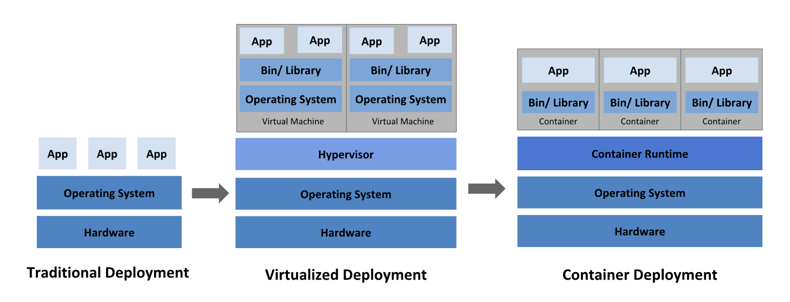

**Table of Contents**
1. [Introduction](#introduction)
    1. [YAML](#yaml)
1. [Kubernetes Architecture](#kubernetes-architecture)
    1. [Cluster Architecture](#cluster-architecture)
    2. [etcd in Kubernetes](#etcd-in-kubernetes)
    3. [Kube-API Server](#kube-api-server)
    4. [Kube Controller Manager](#kube-controller-manager)
    5. [Kube Scheduler](#kube-scheduler)
    6. [Kubelet](#kubelet)
    7. [Kube Proxy](#kube-proxy)
1. [Core Concepts](#core-concepts)
    1. [Kubernetes Objects](#kubernetes-objects)
    1. [Pods](#pods)
    2. [ReplicaSets](#replicasets)
    3. [Deployments](#deployments)
    4. [Namespaces](#namespaces)
1. [Application Configuration](#application-configuration)
    1. [Environment Variables](#environment-variables)
    2. [ConfigMaps](#config-maps)
    3. [Secrets](#secrets)
    1. [Readiness and Liveness Probes](#readiness-and-liveness-probes)
1. [Pod Design](#pod-design)
    1. [Labels and Selectors](#labels-and-selectors)
    2. [Rolling Updates and Rollbacks](#rolling-updates-and-rollbacks)
1. [Services and Networking](#services-and-networking)
    1. [Services (Cluster IP](#services)
    3. [Ingress Networking](#ingress-networking)
1. [Additional References](#additional-references)

## Introduction
The content for this week is based on the official [Certified Kubernetes Application Developer](https://github.com/cncf/curriculum/blob/master/CKAD_Curriculum_v1.22.pdf) curriculum. I have added a few parts around the Kubernetes architecture and removed everything around storage and monitoring to keep the content somewhat manageable. 

It is not essential that you can remember every single detail from this week, but understand general idea and how Kubernetes works.

OpenShift will make interacting with a lot of these concepts significantly easier. And please don't feel afraid by the overwhelming amount of material, I know it's a lot. It will become easier!

### YAML
Love it or hate it - you better make piece with the fact that you are gonna see more YAML files than you will see your children.

If you don't know how to use YAML, you better learn it now. Learn it properly once, it's worth it and it shouldn't take more than 30 minutes. 

Everything in Kubernetes is expressed in YAML files.

[CloudBees - Getting started with YAML](https://www.cloudbees.com/blog/yaml-tutorial-everything-you-need-get-started)

[YAML: Learn in X minutes](https://learnxinyminutes.com/docs/yaml/)
## Kubernetes Architecture
Kubernetes is a portable, extensible, open-source platform for managing containerized workloads and services, that facilitates both declarative configuration and automation.

Let's remember - we talked about containers in the last week. Containers itself are fairly primitive and are 'only' a way to package up an application. A container by itself is pretty useless when we think about easing the operations side of things.



Containers are a good way to bundle and run your applications. In a production environment, you need to manage the containers that run the applications and ensure that there is no downtime. For example, if a container goes down, another container needs to start. Wouldn't it be easier if this behavior was handled by a system?

That's how Kubernetes comes to the rescue! Kubernetes provides you with a framework to run distributed systems resiliently. It takes care of scaling and failover for your application, provides deployment patterns, and more. For example, Kubernetes can easily manage a canary deployment for your system.

**Service discovery and load balancing**

Kubernetes can expose a container using the DNS name or using their own IP address. If traffic to a container is high, Kubernetes is able to load balance and distribute the network traffic so that the deployment is stable.

**Storage orchestration**

Kubernetes allows you to automatically mount a storage system of your choice, such as local storages, public cloud providers, and more.

**Automated rollouts and rollbacks** 

You can describe the desired state for your deployed containers using Kubernetes, and it can change the actual state to the desired state at a controlled rate. For example, you can automate Kubernetes to create new containers for your deployment, remove existing containers and adopt all their resources to the new container.

**Automatic bin packing** 

You provide Kubernetes with a cluster of nodes that it can use to run containerized tasks. You tell Kubernetes how much CPU and memory (RAM) each container needs. Kubernetes can fit containers onto your nodes to make the best use of your resources.

**Self-healing** 

Kubernetes restarts containers that fail, replaces containers, kills containers that don't respond to your user-defined health check, and doesn't advertise them to clients until they are ready to serve.

**Secret and configuration management** 

Kubernetes lets you store and manage sensitive information, such as passwords, OAuth tokens, and SSH keys. You can deploy and update secrets and application configuration without rebuilding your container images, and without exposing secrets in your stack configuration.


### Cluster Architecture
So what exactly is it and how does it look from an architecture perspective?

Like this..


Source: [Ashish Patel](https://medium.com/devops-mojo/kubernetes-architecture-overview-introduction-to-k8s-architecture-and-understanding-k8s-cluster-components-90e11eb34ccd)

Ok, I admit that this is not straight forward at this stage. The important thing to understand at this stage is: There is a control plane side and a worker node side.

The control plane is responsible for the actual orchestration part. Think about it like a harbor where container ships are being loaded and unloaded.

The actual container ship are the worker nodes. These worker nodes carry/host your containers. 

The individual parts of the operation will be explained in more detail down below. At this stage, all you need to know:

control plane => harbor

worker nodes => container ships

containers => what the harbor orchestrates onto the container ships are containers, we will call them Pods though.

### etcd in Kubernetes
Think about etcd as the fileroom of the harbor. All information about incoming ships, outgoing ships, container deliveries etc need to be stored somewhere. 

This is what etcd is: A key-value store for all cluster data. 

### Kube-API Server
Kubernetes is fully API driven. The kube-api server is the 'frontend' for the control plane. Think about it as the gate into the harbor. 

The great thing is that you can have more than one gate. If you have more requests for your harbor, just create another gate and balance incoming traffic between the gates.

Most harbors have 3 gates ;)

### Kube Controller Manager
The kube controller manager is actually not one manager but has many managers. Each manager has a partcular job and runs in a loop. At every loop the manager makes sure that their specific area of the harbor is in order and exactly in the way the file system (etcd) tells them to. 

Our managers are really important, because they make sure things are exactly in the state we want them to be at!

### Kube Scheduler
The kube-scheduler is the crane master of the harbor. One ship might look already pretty busy? The crane master will then make sure to load another ship with the next container.

Loading containers is an ongoing tasks. Sometimes it is windy and a container goes over board, then the kube-scheduler needs to reassign a container with the exact same specifications.

### Kubelet
The kubelet is an agent on each of our ships (worker nodes) and makes sure that each pod (1 or more containers) are functioning as expected.

As developers we don't really care about this of course because all we want to do is fill containers with valuable content!

### Kube Proxy
Ok, I am running out of metaphors here! The kube-proxy is a network proxy that runs on each node in the cluster, it is responsible for implementing and adhering to network rules. It also is resposible for handling traffic into the pod.

## Core Concepts

### Kubernetes Objects
Everything in Kubernetes is expressed in YAML and is nothing but an object. 

Kubernetes objects are persistent entities in the Kubernetes system. Kubernetes uses these entities to represent the state of your cluster. Specifically, they can describe:

- What containerized applications are running (and on which nodes)
- The resources available to those applications
- The policies around how those applications behave, such as restart policies, upgrades, and fault-tolerance

A Kubernetes object is a "record of intent"--once you create the object, the Kubernetes system will constantly work to ensure that object exists. By creating an object, you're effectively telling the Kubernetes system what you want your cluster's workload to look like; this is your cluster's desired state.

To work with Kubernetes objects--whether to ```create```, ```modify```, or ```delete``` them--you'll need to use the Kubernetes API. When you use the kubectl command-line interface, for example, the CLI makes the necessary Kubernetes API calls for you. You can also use the Kubernetes API directly in your own programs using one of the Client Libraries.

In the .yaml file for the Kubernetes object you want to create, you'll need to set values for the following fields:

- ```apiVersion``` - Which version of the Kubernetes API you're using to create this object
- ```kind``` - What kind of object you want to create
- ```metadata``` - Data that helps uniquely identify the object, including a name string, UID, and optional namespace
- ```spec``` - What state you desire for the object

The precise format of the object spec is different for every Kubernetes object, and contains nested fields specific to that object. 

```yaml
# The api version is usually something like v1, v2, or apps/v1
apiVersion: apps/v1
# There are various kinds of objects, Deployment is one of them
kind: Deployment
# This is where we can use labels and names to group/order our objects
metadata:
  name: nginx-deployment
# This is the 'body' of our object and specifies what its behaviour
spec:
  selector:
    matchLabels:
      app: nginx
  replicas: 2 # tells deployment to run 2 pods matching the template
  template:
    metadata:
      labels:
        app: nginx
    spec:
      containers:
      - name: nginx
        image: nginx:1.14.2
        ports:
        - containerPort: 80
```

If you knew nothing about the ```Deployment``` object and its content, the [Kubernetes Docs](https://kubernetes.io/docs/concepts/workloads/controllers/deployment/) will be able to help you.

[More on Kubernetes Objects](https://kubernetes.io/docs/concepts/overview/working-with-objects/kubernetes-objects/)

### Pods
A Pod is a set of running containers in a cluster. This means: One or more.

Like individual application containers, Pods are considered to be relatively ephemeral (rather than durable) entities. Pods are created, assigned a unique ID (UID), and scheduled to nodes where they remain until termination (according to restart policy) or deletion. If a Node dies, the Pods scheduled to that node are scheduled for deletion after a timeout period.

Pods do not, by themselves, self-heal. If a Pod is scheduled to a node that then fails, the Pod is deleted; likewise, a Pod won't survive an eviction due to a lack of resources or Node maintenance. Kubernetes uses a higher-level abstraction, called a controller, that handles the work of managing the relatively disposable Pod instances.

Like every other object, a Pod can of course be expressed in YAML:

```yaml
apiVersion: v1
kind: Pod
metadata:
  name: nginx
  mykey: myvalue
spec:
  containers:
  - name: nginx
    # take note of the image label/version
    image: nginx:1.14.2
    ports:
    # The port we want to open
    - containerPort: 80
```

To actually get this file/definition/object into our Kubernetes cluster, we need to tell etcd about it.

The way we would go about this is saving our definition, let's say as ```pod.yaml```. 

```kubectl apply -f pod.yaml```. 

This applies the object in our current namespace.

Other important commands are:

```yaml
# Get pods in current namespace
kubectl get pods

# Describe the pod with the name nginx
kubectl describe pod nginx

# Filter specific information from a pod
kubectl get pod nginx | grep Status

# Delete Pod
kubectl delete pod nginx

# Create a Pod/apply the definition with the name redis.yaml
kubectl create -f redis.yaml

# Edit a running Pod
kubectl edit pod nginx

```

[Pods: Kubernetes Docs](https://kubernetes.io/docs/concepts/workloads/pods/)

[](https://www.youtube.com/watch?v=nbLJ1_SQH1A)

### ReplicaSets
A ReplicaSet's purpose is to maintain a stable set of replica Pods running at any given time. As such, it is often used to guarantee the availability of a specified number of identical Pods.

A ReplicaSet is defined with fields, including a selector that specifies how to identify Pods it can acquire, a number of replicas indicating how many Pods it should be maintaining, and a pod template specifying the data of new Pods it should create to meet the number of replicas criteria. A ReplicaSet then fulfills its purpose by creating and deleting Pods as needed to reach the desired number. When a ReplicaSet needs to create new Pods, it uses its Pod template.

```yaml
apiVersion: apps/v1
# take note of the type 'ReplicaSet' here
kind: ReplicaSet
metadata:
  # this is simply the name of our RS
  name: my-replicaset
spec:
  # The amount of replicas we want to run of our container
  replicas: 2
  # This is important: Read it as "match all labels of the key-value pair 'app: my-app' with a template that has the same key-value pair. See below.
  selector:
    matchLabels:
      app: my-app
  template:
    metadata:
      labels:
        # The key-value pair needs to be matching
        app: my-app
    spec:
      # This is the spec of the actual image we want to deploy
      containers:
      - name: my-container
        image: nginx
```
You will usually not work with ReplicaSets because there is a much cooler thing that offers even more functionality, ```Deployments```. This is covered below.

You can find more on [ReplicaSets in the Kubernetes Docs.](https://kubernetes.io/docs/concepts/workloads/controllers/replicaset/)

[](https://www.youtube.com/watch?v=uQaMDZFP2CI)

### Deployments
A Deployment provides declarative updates for Pods and ReplicaSets.

You describe a desired state in a Deployment, and the Deployment Controller changes the actual state to the desired state at a controlled rate. You can define Deployments to create new ReplicaSets, or to remove existing Deployments and adopt all their resources with new Deployments.

I would strongly recommend reading [this article](https://www.magalix.com/blog/kubernetes-deployments-101)
on ```Deployments``` vs ```ReplicaSets```. On paper they might look the same, as seen below on the YAML definition, but they work quite differently.

In short: A ReplicaSet might lead to downtime because it doesn't have an intelligent rollout strategy, it will just create the desired pods. A ```Deployment``` can specify a variety of rollout strategies, such as ```recreate``` or ```rolling```. Both are explained in more detail in the article linked above.

Definition of a Deployment configuration:

```yaml
apiVersion: apps/v1
kind: Deployment
metadata:
  name: nginx-deployment
  labels:
    app: nginx
spec:
  # At max, we are taking 50% of the containers down when we upgrade to a new version/rollout. This ensures that our application has no downtime.
  strategy:
    type: RollingUpdate
    rollingUpdate:
    maxUnavailable: 50%
  replicas: 4
  selector:
    matchLabels:
      app: nginx
  template:
    metadata:
      labels:
        app: nginx
    spec:
      containers:
      - name: nginx
        image: nginx:1.14.2
        ports:
        - containerPort: 80
```

You can find more on [Deployments in the Kubernetes Docs.](https://kubernetes.io/docs/concepts/workloads/controllers/deployment/)

[](https://www.youtube.com/watch?v=2gpLYpOGvLI)

### Namespaces
Namespaces are intended for use in environments with many users spread across multiple teams, or projects. 

Namespaces provide a scope for names. Names of resources need to be unique within a namespace, but not across namespaces. Namespaces cannot be nested inside one another and each Kubernetes resource can only be in one namespace.

Namespaces are a way to divide cluster resources between multiple users (via resource quota).

It is not necessary to use multiple namespaces to separate slightly different resources, such as different versions of the same software: use labels to distinguish resources within the same namespace.

```yaml
kubectl run nginx --image=nginx --namespace=<insert-namespace-name-here>
kubectl get pods --namespace=<insert-namespace-name-here>

kubectl config set-context --current --namespace=<insert-namespace-name-here>
# Validate it
kubectl config view --minify | grep namespace:
```

You can find more on [Namespaces in the Kubernetes Docs.](https://kubernetes.io/docs/concepts/overview/working-with-objects/namespaces/)

## Application Configuration

### Environment Variables

When you create a Pod, you can set environment variables for the containers that run in the Pod. To set environment variables, include the env or envFrom field in the configuration file.

```yaml
apiVersion: v1
kind: Pod
metadata:
  name: envar-demo
  labels:
    purpose: demonstrate-envars
spec:
  containers:
  - name: envar-demo-container
    image: gcr.io/google-samples/node-hello:1.0
    env:
    - name: DEMO_GREETING
      value: "Hello from the environment"
    - name: DEMO_FAREWELL
      value: "Such a sweet sorrow"
```

When you create a Pod, you can set dependent environment variables for the containers that run in the Pod. To set dependent environment variables, you can use $(VAR_NAME) in the value of env in the configuration file.

For example:
```yaml
apiVersion: v1
kind: Pod
metadata:
  name: dependent-envars-demo
spec:
  containers:
    - name: dependent-envars-demo
      args:
        - while true; do echo -en '\n'; printf UNCHANGED_REFERENCE=$UNCHANGED_REFERENCE'\n'; printf SERVICE_ADDRESS=$SERVICE_ADDRESS'\n';printf ESCAPED_REFERENCE=$ESCAPED_REFERENCE'\n'; sleep 30; done;
      command:
        - sh
        - -c
      image: busybox
      env:
        - name: SERVICE_PORT
          value: "80"
        - name: SERVICE_IP
          value: "172.17.0.1"
        - name: UNCHANGED_REFERENCE
          value: "$(PROTOCOL)://$(SERVICE_IP):$(SERVICE_PORT)"
        - name: PROTOCOL
          value: "https"
        - name: SERVICE_ADDRESS
          value: "$(PROTOCOL)://$(SERVICE_IP):$(SERVICE_PORT)"
        - name: ESCAPED_REFERENCE
          value: "$$(PROTOCOL)://$(SERVICE_IP):$(SERVICE_PORT)"
```
[](https://www.youtube.com/watch?v=hdnSMcnGTbQ)


### ConfigMaps
A ConfigMap is an API object used to store non-confidential data in key-value pairs. Pods can consume ConfigMaps as environment variables, command-line arguments, or as configuration files in a volume.

A ConfigMap allows you to decouple environment-specific configuration from your container images, so that your applications are easily portable.

     Caution: ConfigMap does not provide secrecy or encryption. If the data you want to store are confidential, use a Secret rather than a ConfigMap, or use additional (third party) tools to keep your data private.

I strongly recommend reading up on [ConfigMaps and their applications.](https://kubernetes.io/docs/concepts/configuration/configmap/)

[](https://www.youtube.com/watch?v=hdnSMcnGTbQ)

### Secrets
Secrets are encrypted pieces of information that we can make available to Kubernetes objects - often Deployments.

```yaml
apiVersion: v1
kind: Secret
metadata:
  name: test-secret
data:
  username: bXktYXBw
  password: Mzk1MjgkdmRnN0pi
```

You could make this secret now available to a Pod:
```yaml
apiVersion: v1
kind: Pod
metadata:
  name: secret-test-pod
spec:
  containers:
    - name: test-container
      image: nginx
      volumeMounts:
        # name must match the volume name below
        - name: secret-volume
          mountPath: /etc/secret-volume
  # The secret data is exposed to Containers in the Pod through a Volume.
  volumes:
    - name: secret-volume
      secret:
        secretName: test-secret
```

[](https://www.youtube.com/watch?v=ZKsl28RUvH4)

### Readiness and Liveness Probes
The kubelet uses liveness probes to know when to restart a container. For example, liveness probes could catch a deadlock, where an application is running, but unable to make progress. Restarting a container in such a state can help to make the application more available despite bugs.

The kubelet uses readiness probes to know when a container is ready to start accepting traffic. A Pod is considered ready when all of its containers are ready. One use of this signal is to control which Pods are used as backends for Services. When a Pod is not ready, it is removed from Service load balancers.

The kubelet uses startup probes to know when a container application has started. If such a probe is configured, it disables liveness and readiness checks until it succeeds, making sure those probes don't interfere with the application startup. This can be used to adopt liveness checks on slow starting containers, avoiding them getting killed by the kubelet before they are up and running.

There is a lot more to learn about this, [please have a lot at the docs.](https://kubernetes.io/docs/tasks/configure-pod-container/configure-liveness-readiness-startup-probes/)

[](https://www.youtube.com/watch?v=_9R0x_FoiHY)


## Pod Design

### Labels and Selectors
Labels are key/value pairs that are attached to objects, such as pods. Labels are intended to be used to specify identifying attributes of objects that are meaningful and relevant to users, but do not directly imply semantics to the core system. Labels can be used to organize and to select subsets of objects. Labels can be attached to objects at creation time and subsequently added and modified at any time. Each object can have a set of key/value labels defined. Each Key must be unique for a given object.

```yaml
"metadata": {
  "labels": {
    "key1" : "value1",
    "key2" : "value2"
  }
}
```
Labels allow for efficient queries and watches and are ideal for use in UIs and CLIs. Non-identifying information should be recorded using annotations.

Labels enable users to map their own organizational structures onto system objects in a loosely coupled fashion, without requiring clients to store these mappings.

Service deployments and batch processing pipelines are often multi-dimensional entities (e.g., multiple partitions or deployments, multiple release tracks, multiple tiers, multiple micro-services per tier). Management often requires cross-cutting operations, which breaks encapsulation of strictly hierarchical representations, especially rigid hierarchies determined by the infrastructure rather than by users.

**Example labels:**

- "```release```" : "```stable```", "```release```" : "```canary```"
- "```environment```" : "```dev```", "```environment```" : "```qa```", "```environment```" : "```production```"
- "```tier```" : "```frontend```", "```tier```" : "```backend```", "```tier```" : "```cache```"
- "```partition```" : "```customerA```", "```partition```" : "```customerB```"
- "```track```" : "```daily```", "```track```" : "```weekly```"

[!!! Please review these commonly used labels. !!!](https://kubernetes.io/docs/concepts/overview/working-with-objects/common-labels/)

And read the [relevant section in the docs](https://kubernetes.io/docs/concepts/overview/working-with-objects/labels/).

[](https://www.youtube.com/watch?v=mMslJF-Hzqs)

### Rolling Updates and Rollbacks
Users expect applications to be available all the time and developers are expected to deploy new versions of them several times a day. In Kubernetes this is done with rolling updates. Rolling updates allow Deployments' update to take place with zero downtime by incrementally updating Pods instances with new ones. The new Pods will be scheduled on Nodes with available resources.

In Kubernetes, updates are versioned and any Deployment update can be reverted to a previous (stable) version.

The following example shows how a rolling update works.

First, we have a deployment that manages 4 containers across 3 nodes. The Deployment is upgraded to a new verion. 


Because we have a rolling update and want to take down one pod at a time, the one in the top left is taken down first and then redeployed with the new version.


The same is now done with the container in the bottom.


The same is repeated until all containers are upgraded to the new version specified in the deployment.


If we can do that, it makes sense that we can also [rollback to a previous version.](https://kubernetes.io/docs/concepts/workloads/controllers/deployment/#rolling-back-a-deployment)

[](https://www.youtube.com/watch?v=VDwBc7LQQiY)


## Services and Networking

### Services
Services are an abstract way to expose an application running on a set of Pods as a network service.

With Kubernetes you don't need to modify your application to use an unfamiliar service discovery mechanism. Kubernetes gives Pods their own IP addresses and a single DNS name for a set of Pods, and can load-balance across them.

Why?

Kubernetes Pods are created and destroyed to match the state of your cluster. Pods are nonpermanent resources. If you use a Deployment to run your app, it can create and destroy Pods dynamically.

Each Pod gets its own IP address, however in a Deployment, the set of Pods running in one moment in time could be different from the set of Pods running that application a moment later.

This leads to a problem: if some set of Pods (call them "backends") provides functionality to other Pods (call them "frontends") inside your cluster, how do the frontends find out and keep track of which IP address to connect to, so that the frontend can use the backend part of the workload?

In Kubernetes, a Service is an abstraction which defines a logical set of Pods and a policy by which to access them (sometimes this pattern is called a micro-service). The set of Pods targeted by a Service is usually determined by a selector.

For example, suppose you have a set of Pods where each listens on TCP port 9376 and contains a label app=MyApp:

```yaml
apiVersion: v1
kind: Service
metadata:
  name: my-service
spec:
  selector:
    app: MyApp
  ports:
    - protocol: TCP
      port: 80
      targetPort: 9376
```

This specification creates a new Service object named "my-service", which targets TCP port 9376 on any Pod with the app=MyApp label.

Kubernetes assigns this Service an IP address (sometimes called the "cluster IP"), which is used by the Service proxies

[](https://www.youtube.com/watch?v=yHObA-rlX-Q)

### Ingress Networking
Ingress Networking is an API object that manages external access to the services in a cluster, typically HTTP.

Ingress may provide load balancing, SSL termination and name-based virtual hosting.

For clarity, this guide defines the following terms:

- **Node**: A worker machine in Kubernetes, part of a cluster.
- **Cluster**: A set of Nodes that run containerized applications managed by Kubernetes. For this example, and in most common Kubernetes deployments, nodes in the cluster are not part of the public internet.
- **Edge router**: A router that enforces the firewall policy for your cluster. This could be a gateway managed by a cloud provider or a physical piece of hardware.
- **Cluster network**: A set of links, logical or physical, that facilitate communication within a cluster according to the Kubernetes networking model.
- **Service**: A Kubernetes Service that identifies a set of Pods using label selectors. Unless mentioned otherwise, Services are assumed to have virtual IPs only routable within the cluster network.

**What is Ingress?**
Ingress exposes HTTP and HTTPS routes from outside the cluster to services within the cluster. Traffic routing is controlled by rules defined on the Ingress resource.

Here is a simple example where an Ingress sends all its traffic to one Service:


An Ingress may be configured to give Services externally-reachable URLs, load balance traffic, terminate SSL / TLS, and offer name-based virtual hosting. An Ingress controller is responsible for fulfilling the Ingress, usually with a load balancer, though it may also configure your edge router or additional frontends to help handle the traffic.

An Ingress does not expose arbitrary ports or protocols. Exposing services other than HTTP and HTTPS to the internet typically uses a service of type Service.Type=NodePort or Service.Type=LoadBalancer.

More on Ingress in the [docs.](https://kubernetes.io/docs/concepts/services-networking/ingress/)

## Additional References

### Kubernetes Docs
[kubernetes.io](https://kubernetes.io/docs/home/)

### Kube by Example
[kube by:example](https://kubebyexample.com/)